# 🛍️ PouletLG – An E-commerce Website for LEGO Products

**PouletLG** is a dynamic and feature-rich e-commerce web application designed for selling LEGO products. Built using **ASP.NET Core MVC** and backed by **SQL Server**, this project delivers a smooth and intuitive shopping experience for LEGO enthusiasts, while also offering powerful administrative tools for product and order management.

---

## 🎯 Project Goals
The objective of **PouletLG** is to deliver a modern, full-featured e-commerce platform for LEGO products, ensuring a seamless shopping experience for users and providing powerful management tools for administrators.

## 🛒 Customer Features

- Browse LEGO products by category  
- View detailed product pages with images, descriptions, pricing, and more  
- Add products to shopping cart or wishlist  
- Choose payment methods: Cash on Delivery (COD) or VNPay  
- Track order status and view complete order history  
- Submit product ratings and reviews  
- Request returns or exchanges directly through the system  
- Earn loyalty points and unlock membership tiers (Bronze, Silver, Gold)  
- Receive automated email notifications for order confirmations and updates  
- Participate in LEGO building competitions with community voting  
- Join a LEGO user forum to share creations, get tips, and interact with other fans  

## 🛒 Admin Features

- Manage products, categories, inventory, and promotional campaigns  
- Handle customer accounts, orders, returns, and exchanges  
- Edit static content: banners, About Us, Contact page, etc.  
- Automate stock updates upon order completion  
- Set up and manage discount programs based on membership tiers  
- Automatically upgrade user tiers based on total spending  
- Generate detailed reports on sales, best-selling items, and order statuses  
- Manage customer support via an integrated Help Center  

## 🛠️ Technologies Used

- ASP.NET Core MVC  
- Entity Framework Core  
- SQL Server  
- Bootstrap / Razor Views  
- Identity for Authentication & Authorization  

## 📦 Database

The project includes a `.sql` file for database structure and seed data.  
You can import it into SQL Server using SQL Server Management Studio (SSMS).

## ⚙️ Setup Instructions

1. Clone the repository  
2. Import the database from the `.sql` file  
3. Update `appsettings.json` with your local DB connection string  
4. Build and run the project in Visual Studio  

## 📸 Some Demo Images of the Project

### 🛍️ Customer Interface & Features

**Home Page** – Displays banners, categories, featured and discounted products  
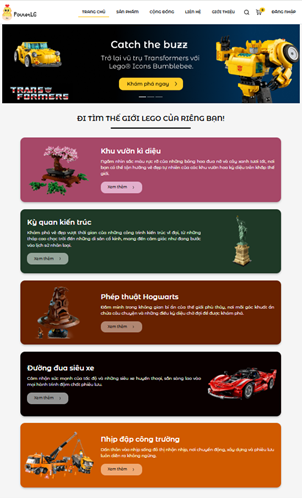  
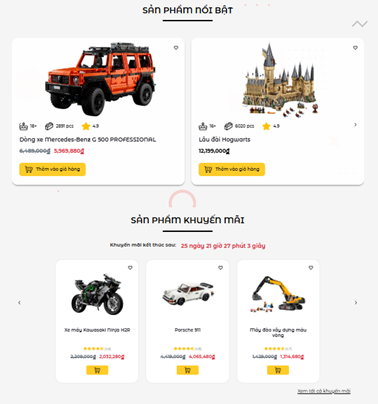  

**Product List Page** – Filter and search by name, category, price, or promotions  
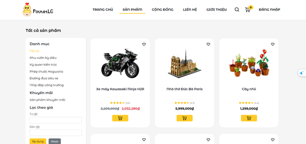  

**Product Detail Page** – Detailed description, number of pieces, age range, reviews  
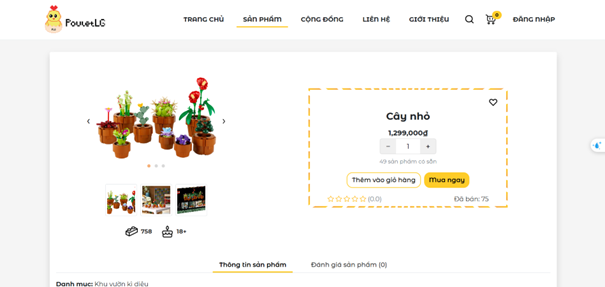  

**Shopping Cart** – Manage quantity, calculate total price, shipping fees, and discounts  
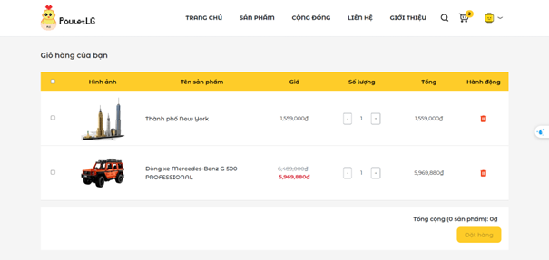  

**Checkout** – COD or VNPay, choose address, apply discount codes  
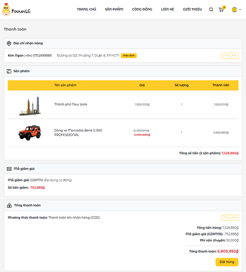  

**User Account – Profile** – Personal information, rank, discount codes  
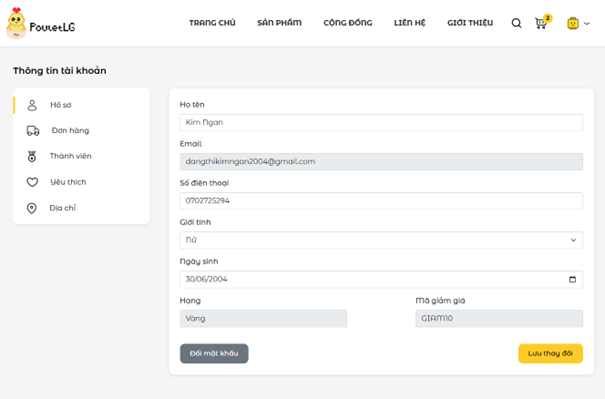  

**User Account – Orders**  
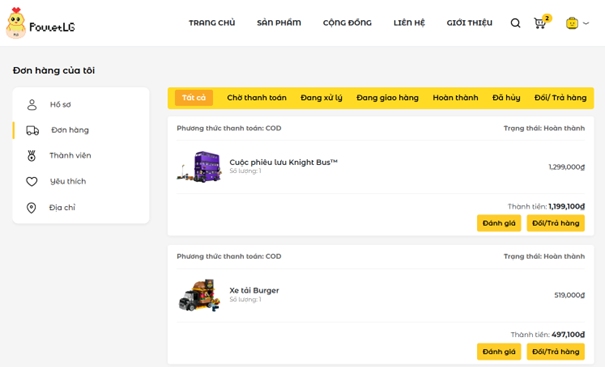  
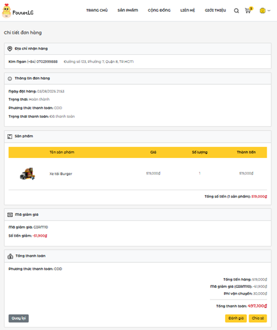  

**User Account – Membership** – Membership tiers, accumulated points  
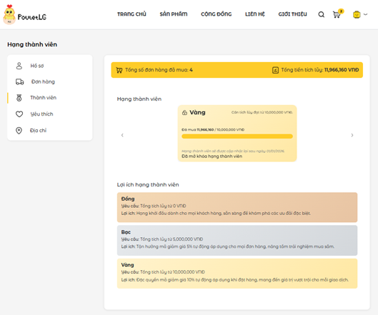  

**User Account – Wishlist**  
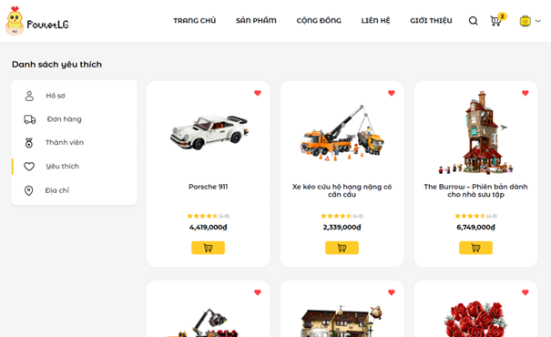  

**User Account – Addresses**  
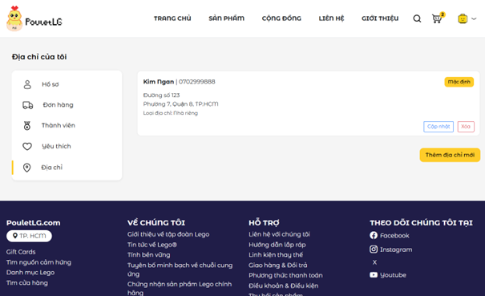  

**Product Review**  
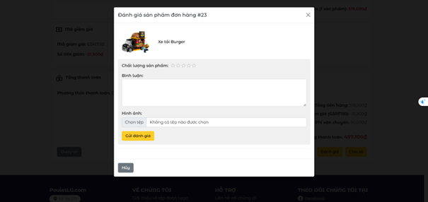  

**Contests**  
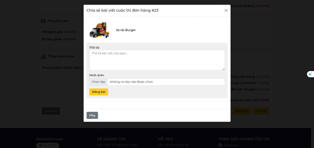  
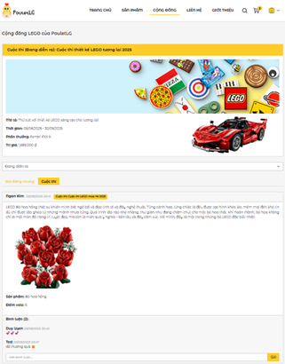  

**Community** – LEGO forum for sharing and discussion  
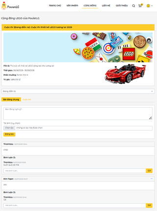  

### 🛠️ Admin Interface & Features

**Dashboard (Reports & Statistics)**  
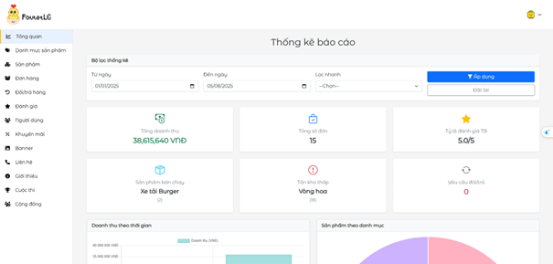  

**Category Management**  
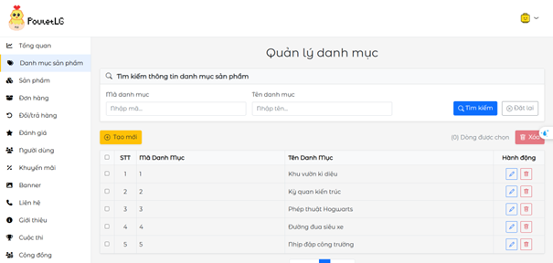  

**Product Management**  
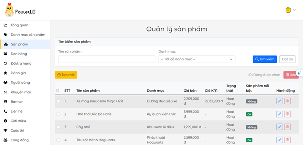  

**Promotion Management**  
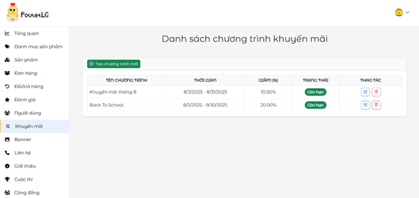  

**Order Management**  
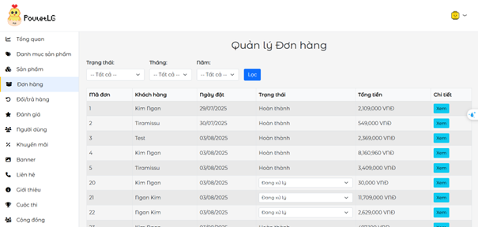  

**Review Management**  
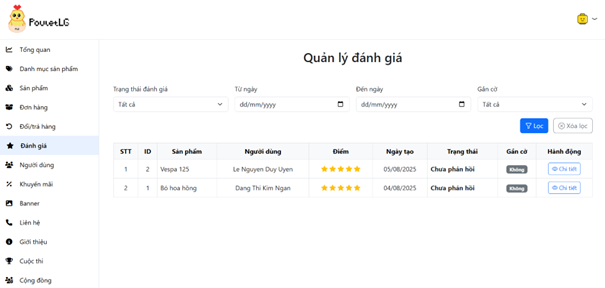  

**User Management**  
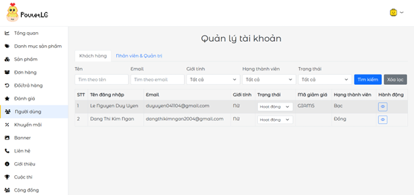  
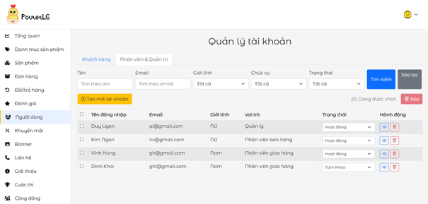  

**Banner Management**  
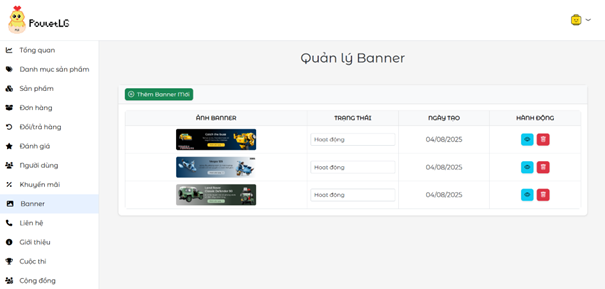  

**Contact Page Management**  
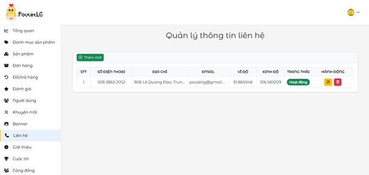  

**About Page Management**  
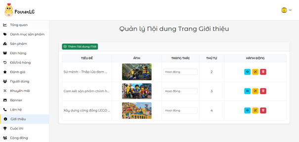  

**Contest Management**  
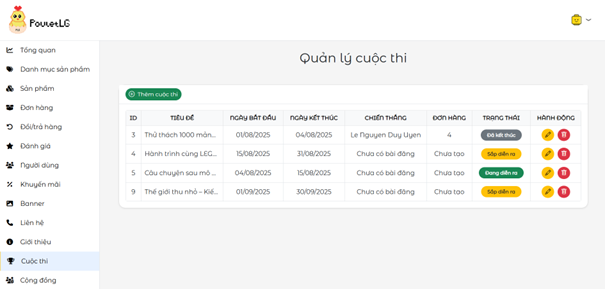  

**Community Management**  
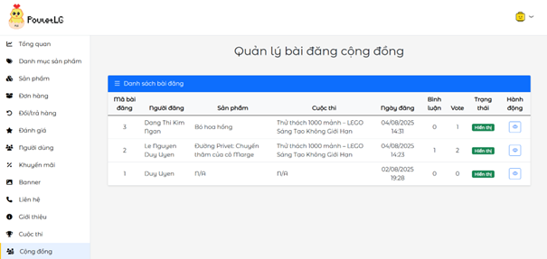  

### 🔐 Authentication & Authorization

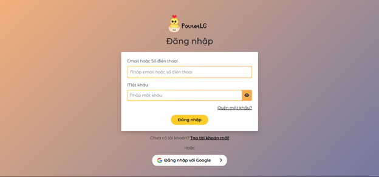  
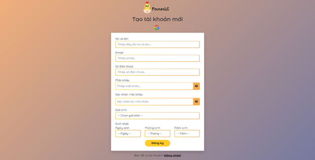  
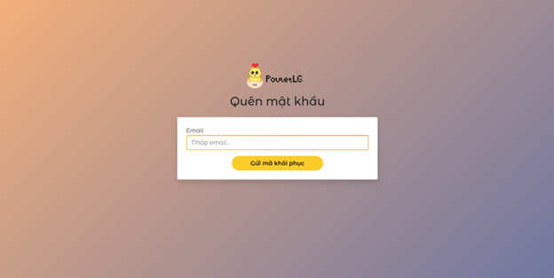  
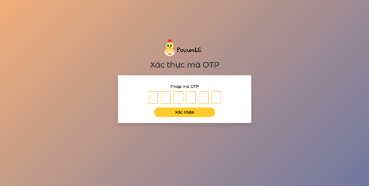  

---

Feel free to contribute or open issues for improvements!
